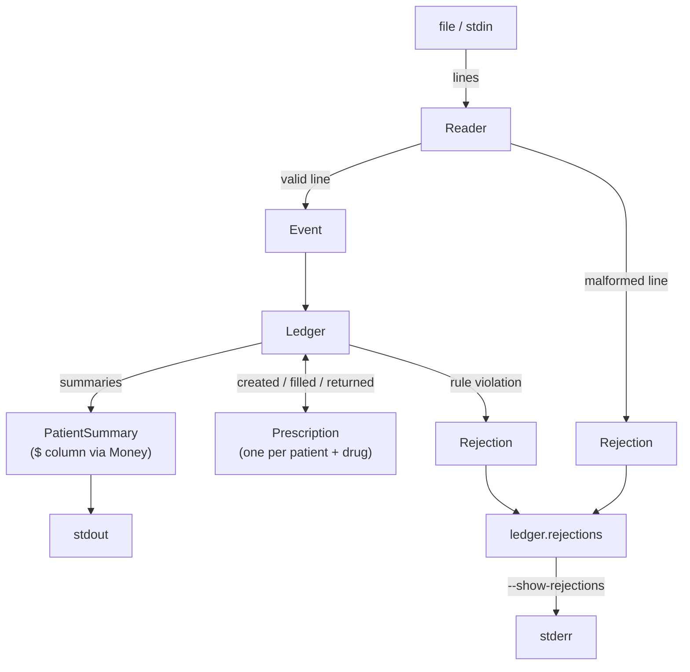

# Prescription Report Ingestion Service

Reads a stream of pharmacy prescription events and prints a per-patient report
of outstanding fills and income.

## Requirements

- Ruby 3.4.x (see `.ruby-version`)
- Bundler

```sh
bundle install
```

## Usage

```sh
bin/prescription_report FILE
# or pipe events on stdin
cat events.txt | bin/prescription_report
```

Options:

| Flag | Effect |
| --- | --- |
| `--show-rejections` | Print discarded lines to stderr |
| `-h`, `--help` | Show usage |

### Example

```sh
$ bin/prescription_report test/fixtures/sample_input.txt
Mark: 2 fills $9 income
John: 0 fills -$1 income
Nick: 0 fills $0 income
```

With `--show-rejections` the ignored lines are written to stderr first:

```
discarded line 4: invalid filled (Mark/C filled -- prescription was never created)
discarded line 9: invalid filled (Paul/D filled -- prescription was never created)
```

For more context on the input/output constraints, ref https://gist.github.com/mikeletscher/33689daf0cd0644e248ed8f492e4a4d2


## Development

```sh
rake            # tests + RuboCop (the default task)
rake test       # tests only
bundle exec rubocop
```

CI runs the same checks on every push to `main` and every pull request
(`.github/workflows/ci.yml`).

## Testing

Minitest, spec-style, one test file per class, each exercised through its public
interface only. Value objects (`Event`, `Rejection`, `PatientSummary`,
`Prescription`, `Money`) cover construction, immutability, and their derived
values. `Reader` leans on parsing edge cases — field counts, whitespace and tabs,
blank lines, unknown types, `String` vs `StringIO` — and `Ledger` is driven end
to end, `ingest` a string then read `summaries` / `rejections`, down to a test
that reproduces the exact report for the sample input. `EventType` is pinned down
on its own as the parse chokepoint everything downstream trusts. The CLI wrapper
(`bin/prescription_report`) has no automated test and is verified by hand.


## Architecture

Data flows one way and in a single pass: each line is parsed into an `Event`,
events accumulate into a `Prescription` per `(patient, drug)`, and that state is
rendered as the report. A line that breaks a rule becomes a `Rejection` and is
set aside



Each class has one responsibility:

* `Reader` - streams the source one line at a time and turns each line into an `Event` (valid) or a `Rejection` (invalid). Can pick up events if fields are single space, multi space or tab aligned

* `EventType` - contains a finite set of types `created, filled & returned`. Raises error on unknown event type

* `Event` - immutable value object (`Data.define`). Carries four fields, patient, drug, type & source line
The `key` identifies the prescription the event belongs to `[patient, drug]`

* `Rejection` - immutable value object (`Data.define`). Gets created when core business logic is violated, e.g. `prescription already exists`, `prescription was never created`, or unknown field types are introduced

* `Patient Summary` - immutable value object (`Data.define`). It's the output side of `Event`. Holds one patient final result in 3 fields, patient, fills and income

* `Prescription` - the one class that holds mutable state and changes over time. It tracks the line of one `(patient, drug)` prescription as events and it stores fills and returns

* `Ledger` - the orchestrator. It houses all the business logic and it's the main hub for all the other classes

* `Money` - formats integer cents as $9 / -$1 / $1.50

## Design Decisions

* When I first approached this problem, it felt like I needed to use a state machine but after careful thought, it turned out to be a counter problem.
The example `created => filled => returned` reads like a finite state transition table, but that's wrong. Each
prescription can be filled repeatedly and refilled after a return. There is no single state label for 'filled 3 times and returned once' so there is only a count. The `Prescription` then stores the fills and returns and derives everything else hence the outstanding count and income.

* I added `Rejection` because there is no such thing as a perfect world and if there are any inconsistencies, we should be able to handle them gracefully. A malformed or invalid line becomes a `Rejection` and it is skipped. It never aborts the run or mutates the state. i.e. One bad line in a large batch shouldn't lose the whole batch.

* The immutable objects (Event, Rejection, Patient Summary) are frozen; the mutable ones (Prescription, Ledger) are not, because they change over time during the run.

* The `Reader` reads one line at a time rather than gulping the entire file so it's memory conscious

* The report is ordered by fills descending and then patient name

## Tradeoffs

* It is not thread safe. The `Ledger` runs in a mutable state so a single instance of consuming a file can't be shared across threads.

* Rejections are held in memory and not streamed out.

* Objects over raw speed. Each line is turned into an Event and each result into a PatientSummary rather than counted inline, which allocates objects a performance-critical version would avoid. Worth it for the testability and clean boundaries at any realistic scale.
